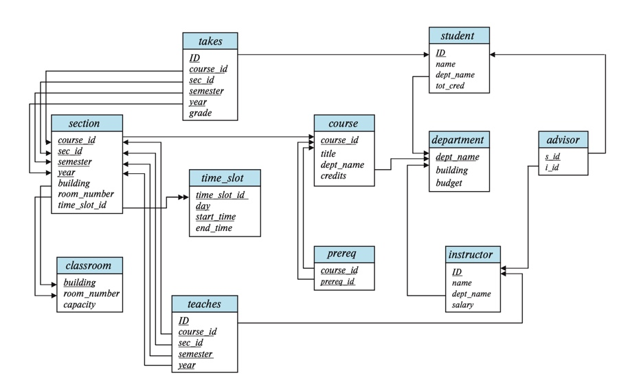

# Introduction to the Relational Model 
__The relational model is the primary model for commerical data processing applications.__

## Structure of the Relational Databases
a. A relational database consits of tables

b. generally, a row in a table represents a relationship among a set of values 

c. `RELATION` - a table 

d. `TUPLE` - a row 

e. `ATTRIBUTE` - a column in a table 

f. `RELATIONAL INSTANCE` - refers to a specific instance of a relation, or a specific set of rows 
      - ordered or unordered does __NOT__ matter as long as the same relations are in the set 
      
$$\\[.1cm]$$
g. `DOMAIN` - set of permitted values for an attribute of a relation 
            
      Ex. the domain of salary attribute of the instructor relation is the set of all possible salaries. 
       
h. `NULL VALUES` - signifies that a value is __UNKNOWN__ or does not exist 
      - best not to have null values as they will cause difficulties updating & accessing database 
      
## Database Schema 
a. `DATABASE SCHEMA` - the logical design of the database 
b. `DATABASE INSTANCE` - snapshot of the data in the database at a given time 

c. `RELATIONAL SCHEMA` - list of attributes & their corresponding domains 
      - relational instance - the value of a variable at a given time --> may change 
      - relational schema does not change 
      - relational instance and schema are often used interchageably
            
            
            Ex. instructor may mean instructor schema or instructor instance!!!

## EXCLUDED

## Schema Diagrams 
a. `SCHEMA DIAGRAM` - depicts a database schema, all the keys, etc. 
      - relations are represented by __BOXES__ w/name on top and attributes listed inside the box 
      - primary keys are __UNDERLINED__ 
      - foreign key constraints are __ARROWS__ from foreign key attribute of referencing relation to the primary key of the referenced table 
      - referential integrity constraints are __TWO-HEADED ARROWS__
      

{}

[Example of a Schema Diagram]()

## Relational Query Language
a. `QUERY LANG.` - a language in which a user request info. from database 

b. `IMPERATIVE QUERY LANG.` - user instructs the system to perform a specific sequence of operations on the database to compute the desired results 

c. `FUNCTIONAL QUERY LANG.` - the computation is expressed as the evaluation of functions that may operate on the data or results of other functions

d. `DECLARATIVE QUERY LANG.` - user describes the desired info. w/o giving a specific instructions or function calls for obtaining the info. 
      - desired info. is usually expressed in some form of __mathematical logic__ 
      
:::note 
Usually query lang. such as SQL have elements of all 3 approaches.
::: 

## Relational Algebra 
a. `RELATIONAL ALGEBRA` - set of operations that take one or two relations as input & produce a new relation 
      - unary operations - operate on __ONE__ relation 
      
      
            Ex. select, project, & rename operations 
      
   - binary operations - operate on a pair of relations
    
      
            Ex. cartesian product, union, set-difference 
      
:::note 
Binary and unary operations can be combined in relational algebra expressions.
::: 
      
      
      
      
      
      
      
      
      
            

