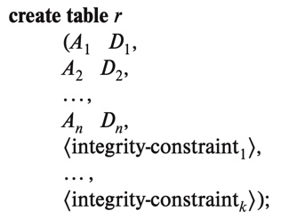

# Introduction to SQL 

## Overview of the original version of SQL 

a. IBM originally developed SQL, then called _Sequel_, in 1970s

b. in 1986 - American National Standards Institute (ANSI) & International Organization for Standarization (ISO) published an SQL standard called __SQL-86__
      - followed by SQL-89, SQL-92, SQL:1999, SQL:2003, SQL:2006, SQL:2008, SQL:2011, & most recently SQL:2016
 
 $$\\[.1cm]$$
 
c. SQL has several parts:
      1. DDL - commands for defining, deleting, & modifying relation schemas
      2. DML - provides ability to query info. from database, & to insert, delete, & modify tuples 
      3. Integrity - commands for specfying integrity constraints that the data must satisfy 
      4. View definitions - SQL DDL has commands fro defining views
      5. Transactions - commands for specfying beginning & end of transactions
      6. Embedded SQL & dynamics SQL - defines how SQL can be embedded w/general programming languages 
      7. Authorizations - SQL DDL includes commands for specifying access rights to views and relations 
       

## SQL Data Defintion
SQL buit-in types:

1. __char(n)__ - _n_ length character string 

2. __varchar(n)__ - _n_ maximum length varying character string 

3. __int/integer__ - finite subset of integer 

4. __smallint__ - a small integer 

5. __numeric(p, d)__ - a fixed point number w/user-specified precision; _p_ is the number of digits & _d_ is the number of digits after the decimal point 

            Ex. numeric(3,1) can store 44.5 but NOT 444.5

6. __real, double__ - floating point & double precision floating numbers 

7. __float(n)__ - floating number w/at least _n_ digits 

8. __nvarchar__ - stores multilingual data 

:::note 
When comparing a char type to a varchar type, spaces will be added DEPENDING on the database. Thus a comparision of A (char type) = A (varchar type) may return false, so ALWAYS use varchar. 
:::

$$\\[.1cm]$$

b. `create table` - command to create a relation 
      - general form is 

{}

[where r = name of table, A~i~ = attribute, & D~i~ = domain of attribute, type of attribute, & constraints ]()

$$\\[.1cm]$$

{}

[Query Examples]()

$$\\[.1cm]$$

d. __drop table__ _r_ - deletes all info. about table _r_ and removes it from the database 

e. __delete from__ _r_ - deletes all the rows in  table _r_ but does __NOT__ delete it from the database 

f. __alter table__ _r_ __add__ A D - adds atribute _A_ of type _D_ to an existing table _r_  & assigns it null values (the default)

g. __alter table__ _r_ __drop__ A - drop attribute _A_ from table _r_ 
      - many database systems do NOT allow attributes to be dropped despite allowing tables to be dropped 
      
      
## Basic structure of SQL queries 
a. Basic structure consists of 3 clauses __SELECT__, __FROM__, $ __WHERE__ 

b. __SELECT__ allows duplicates in results 
      - use __SELECT DISTINCT__ to remove duplicates 
      - use __SELECT ALL__ to explicitly specify duplicates are NOT removed 
      - __SELECT__ also allows arthmetic expressions w/+, -, *, & / 
      
$$\\[.1cm]$$

c. __WHERE__ - specify the requirement/predicate involving attributes 
      - allows logical connectiveness __AND__, __OR__, & __NOT__ 
      - operands can be expressions w/comparsion operators <, <=, >, >=, =, & <>

$$\\[.1cm]$$

d. General meaning of a SQL query:
      1. generate a cartesian product of the tables listed in the __FROM__ clause 
      2. apply the predicates specified in the __WHERE__ clause on the result of step 1 
      3. for each row in the result of step 2, output the attributes specified in the __SELECT__ clause 
      
:::note 
This is NOT how SQL queries are executed. A real implementation would only generate elements of the cartesion product that satisfy the where clause predicates.

:::

## Additional Basic Operations 

a. `as` clause - used to rename the attributes of a resulting relation 
      - can be used w/select & from clause  

 $$\\[.1cm]$$
      
b. `correlation name` -  an identifier that is used to rename a relation 
      - a.k.a table alias, correlation variable, tuple variable
      
$$\\[.1cm]$$
      
c. String Operators: 
      - upper(s) - makes string 's' all _uppercase_
      - lower(s) - converts string 's' to all _lowercase_
      - trim(s) - removes the space at the end 
      - like - operator used for pattern matching 
  $$\\[.1cm]$$

d. `LIKE` - used to express patterns
      - there are 2 special characters for describing patterns: % and _
      - % matches any substring 
      - _ matches any character 
      - patterns are case __SENSITIVE__ 
      - 'Intro%' matches any string beginning w/"Intro"
      - '%Comp%' mathches any string containing "Comp" as a substring 
      - '___' mathces any string w/exactly 3 characters
      - '___%' - matches any string of at least 3 characters
      

            Ex. "Find all the names of all departments whose building names includes the substring 'Watons'.
            SELECT dept_name
            FROM department
            WHERE building LIKE '%Watson%' 
      
$$\\[.1cm]$$

e. `escape` keyword - used immediately before % and _ to indicate that it is to be treated like a normal character 
      
         Ex.
            1. LIKE 'ab\%cd%'escape'\' matches all strings beginning w/"ab%cd" 
            2. LIKE 'ab\\cd%'escape'\' matches all strings beginning w/"ab\cd"
            
f. `NOT LIKE` - used to search for mismatches 

g. `* (asterisk)` - used w/select clause to mean all attributes 

h. `ORDER BY` - causes the tuples in the result of a query to appear in a sorted order 
   - default is in _ascending_ order so use __desc__ for descending order
   - can be used on multiple attributes
   
   
      
         Ex.
         SELECT * 
         FROM instructor
         ORDER BY salary desc, name asc; 
         
$$\\[.1cm]$$
         
i. `BETWEEN` - a comparison operator to simplify the where clause that specify that value is less than or equal to a value and greater than or equal to some value 

      
         Ex.
         Write this:
         SELECT name 
         FROM instructor 
         WHERE salary BETWEEN 90000 and 100000; 
      
         Instead of this:
         SELECT name 
         FROM instructor 
         WHERE salary <= 100000 AND salary >= 90000; 

$$\\[.1cm]$$      
      
j. `ROW CONSTRUCTOR` - allows comparison operators to be used on tuples; ($a$~1~, $a$~2~) <= ($b$~1~, $b$~2~) is true if $a$~1~ <=  $b$~1~ & $a$~2~ <= $b$~2~

         Ex. 
         Write this:
         SELECT name, course_id 
         FROM instructor, teaches
         WHERE (instructor.ID, dept_name) = (teaches.ID, 'Biology');
         
         Instead of this:
         SELECT name, course_id 
         FROM instructor, teaches
         WHERE instructor.ID = teaches.ID and dept_name = 'Biology';
         
## Set Operations 
a. `union` - automatically remove duplicates
   - use __UNION ALL__ to retain all duplicates 
   
$$\\[.1cm]$$

b. `intersect` - tuple in common btw 2 tables; automatically remove duplicates 
   - use __INTERSECT ALL__ to retain all duplicates 
   - note that __INTERSECT ALL__ returns the _minimum_ number of duplicates in the 2 tables 
      
   
         Ex. So if 4 sections of ICP 101 were taught in Fall 2017 and 2 sections taught in 
         Spring 2018, then there would be 2 tuples with ICP 101 in 
         the resulting table 
$$\\[.1cm]$$       
c. `except` - outputs all tuples from the first table that is not in the second table; perfroms set difference
   - use __EXCEPT ALL__ to retain duplicates 
   
:::note
EXCEPT ALL returns the number of duplicates in table 1 minus the number of duplicates in table 2 if the difference is POSITIVE.

:::

## Null Values 
a. `NULL VALUES` - presents problems for arithmetic operations, comparisons, and set operations 

b. the result of any arithmetic expressions (+, -, *, or /) is null if any of the input values is null 

c. the result of any comparison w/null values is _unknown_
   - boolean operators are extended to deal w/unknowns 
   - and: 
      1. result of true and unknown is unknown
      2. false and unknown is false 
      3. unknown and unknown is unknown
   - or: 
      1. true or unknown is true
      2. false or unknown is unknown 
      3. unknown or unknown is unknown 
   - not:
      1. result of not unknown is unknown 
   
$$\\[.1cm]$$ 

d. `null` - a special keyword that can be used in the _where_ clause to test for null values 

         Ex. 
         WHERE salary is null 
      
         Alternatively, 
         WHERE salary is not null -> will select not null values 

$$\\[.1cm]$$ 

e. `is unknown` - another special keyword to test whether the result of a comparison is unknown 

         Ex. 
         WHERE salary > 100000 is unknown 
         
         Alternatively, 
         WHERE salary > 100000 is not unknown 
         
:::note 
unknown & not unknown are not supported by several databases 
:::

## Aggregate Functions 
a. aggregate functions take a collection of (a set or multiset) of values as input & returns a single value 
   - SQL offers 5 standard built-in functions 
   - avg -> average 
   - min -> minimum 
   - max -> maximum 
   - sum -> total 
   - count -> count 
   
:::note 
sum & avg must have numeric inputs, other functions can operate on nonnumeric datatypes 
:::
$$\\[.1cm]$$ 

b. `GROUP BY` - forms groups using specified attribute(s)

         Ex. 
         SELECT dept_name, avg(salary) as avg_salary 
         FROM instructors 
         GROUP BY dept_name; 
         
$$\\[.1cm]$$ 

c. `HAVING` clause - applies conditions to each group rather than on a single row

         Ex. 
         SELECT dept_name, avg(salary) as avg_salary 
         FROM instructors 
         GROUP BY dept_name
         HAVING avg(salary) > 42000;
         
   - sequence of operations for queries w/group by & having clauses:
      1. FROM is evaluated first 
      2. if present, WHERE is applied on the resulting table of the from clause 
      3. rows satisfying the WHERE clause are placed into groups in the GROUP BY clause 
      4. if present, HAVING clause is applied to each group & groups that do not satisfy the HAVING clause are removed
      5. SELECT generates a single tuple for each group by applying the aggregate function 
         
:::note
all aggregate functions except count(*) ignore null in their inputs

the count of an empty set is 0, while the result of other functions is null
:::

## Nested Subqueries 
a. `subquery` - a SELECT-FROM-WHERE expression that is nested within another query 

b. `correlated subquery` -  a subquery that uses a correlation name from an outer query 

## Modification of the Databases 
a. `DELETE` - used to remove whole tuples only 
   - DELETE cannot remove attributes, must be the entire row
   
      
         General form:
         DELETE FROM r
         WHERE p; 
   - p is the predicate & r is the relation 
   - DELETE first finds all tuples, t in r for which p(t) is true and then deletes it from r
   - WHERE can be omitted, in which all rows in r are deleted 
   
:::note 
DELETE can only operate on one relation 

if all rows are deleted, the table still exists but is EMPTY
:::

$$\\[.1cm]$$ 

b. `INSERT` -  allows us to add a single tuple or a set of tuples into a relation 
   - tuples inserted must have the correct num. of attributes 

$$\\[.1cm]$$ 

c. `UPDATE` - can change a value in a tuple w/o changing all values

$$\\[.1cm]$$ 

d. `CASE` -  allows us to perform multiple updates in a single UPDATE statement, thereby avoiding the problem w/the order of tuples 

         Ex. 
         general form:
         UPDATE table
         SET attribute = CASE
                           WHEN pred1 then result1
                           WHEN pred2 then result2
                           ...
                           WHEN predN then resultN
                           else result0
                           end 
