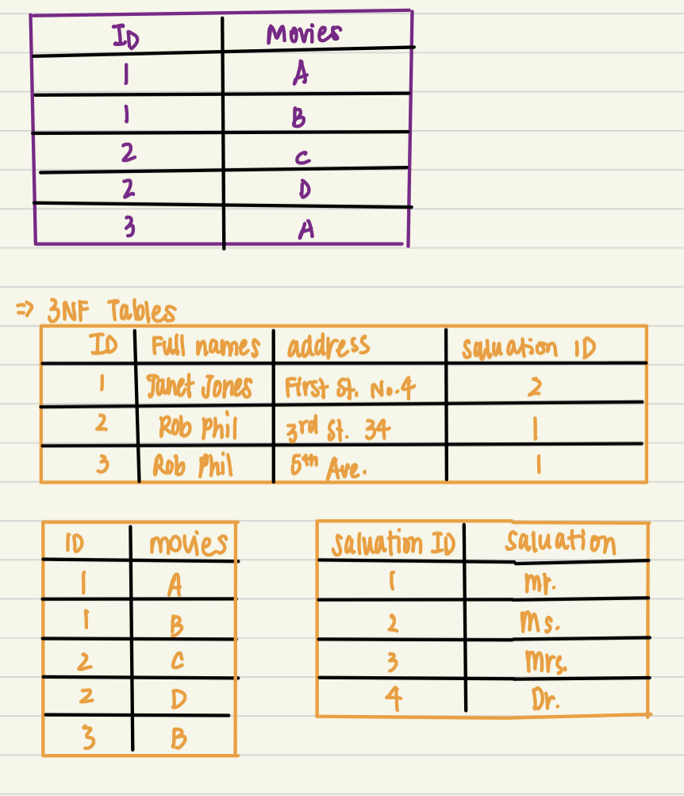

# Relational Database Design 

## Features of a Good Relational Design

{}

[Loss of info. due to a bad Decomposition]()

$$\\[.1cm]$$

a. `LOSSY DECOMPOSITION` - a bad decompositon 

b. `LOSELESS DECOMPOSITION`- no loss of info. by replacing a relation R w/2 relations R~1~ & R~2~
      - for a lossy decomposition, we would get a superset of the original relation 
      
$$\\[.1cm]$$

c. `NORMILIZATION` - goal is to generate a set of tables that allow us to store info. w/o unnecessary redunancy, & yet allows us to retrieve info. easily 
      - General steps:
          
          1. Decide if a table is in "GOOD FORM"
          2. If NOT, decompose it into a num. of smaller relational schemas in a normal form 
          
      
      
## Decomposition using Functional Dependencies 
a. `LEGAL INSTANCE` - of a relation is one that satifies all real-world constraints

        Ex. students & instructors at a university must have an unqiue ID
        
       
       
## Normal Forms 
a. `NORMILIZATION` - a technique of orgainizing data in a database by decomposing tables to eliminate redunancy, & undesirable characteristics (insertion/update/deletion anomalities)
      - the process takes large tables, divides them into smaller tables, and link them using relationships 
      - proposed by *Edgar Codd*, inventor of the relational model 
$$\\[.1cm]$$

b. All the normal forms:
      - 1NF - ensure atomic and unique values 
      - 2NF - removes partial dependencies 
      - 3NF - remove transitive dependencies 
      - BCNF/3.5NF 
      - 4NF - remove multi-valued dependencies 
      - 5NF - remove join dependencies 
      - 6NF - not standarized 
      
      
$$\\[.1cm]$$

c. 1NF rules:
      - each cell contain a single value 
      - each entry is unqiue 

$$\\[.1cm]$$

d. 2NF rules:
      - be in 1NF 
      - have a single column primary key 
      
:::note 
1. Primary Key - a single column value used to identify an entry uniquely
      - cannot be *NULL* 
      - must be *UNIQUE* 
      - should rarely be changed 
      - must be given a new value when a *NEW* entry is inserted 

2. Composite Key - key composed of multiple columns to uniquely identify an entry

::: 

$$\\[.1cm]$$

e. 3NF rules:
      - best for most pratical applications 
      - be in 2NF 
      - have no transitive functional dependencies 

:::note 
Transitive functional dependencies - when changing a non-key column, might cause any of the other non-key columns to change
:::
$$\\[.1cm]$$

{width=75%}

[Example of 1NF]()

{width=75%}

[Example of 2NF & 3NF]()

$$\\[.1cm]$$

f. BCNF:
      - section under construction 

$$\\[.1cm]$$

g. 4NF rules:
      - be in 3NF 
      - table shold not have multivalued dependencies 

:::note 
Conditions for Multi-valued dependencies (all must be true):
      1. for a dependency A -> B (for a single A), multiple values of B exist 
      2. have at least 3 columns 
      3. for the other 2 columns, B & C, they should be independent
 
 MVD occurs due to bad database design  
:::

$$\\[.1cm]$$

h. 5NF (a.k.a PJNF or Project Join Normal Dependency) rules:
      - be in 4NF 
      - not have Join Dependency 
      
:::note 
Join Dependency - when a table can be broken down into 2 seperate tables & no data is loss and when the 2 tables can be joined w/o no new entries being created

:::

{}

[Example of 5NF]()

$$\\[.1cm]$$

      - from these 3 decomposed tables, info. is lost b/c we do *NOT* know definitive that Ford brought 72XSW from ACME since in the original table, Ford also brought 72XSW from ALWAT
            
      - thus, the orginal table does not have join dependency and is already in 5NF 

