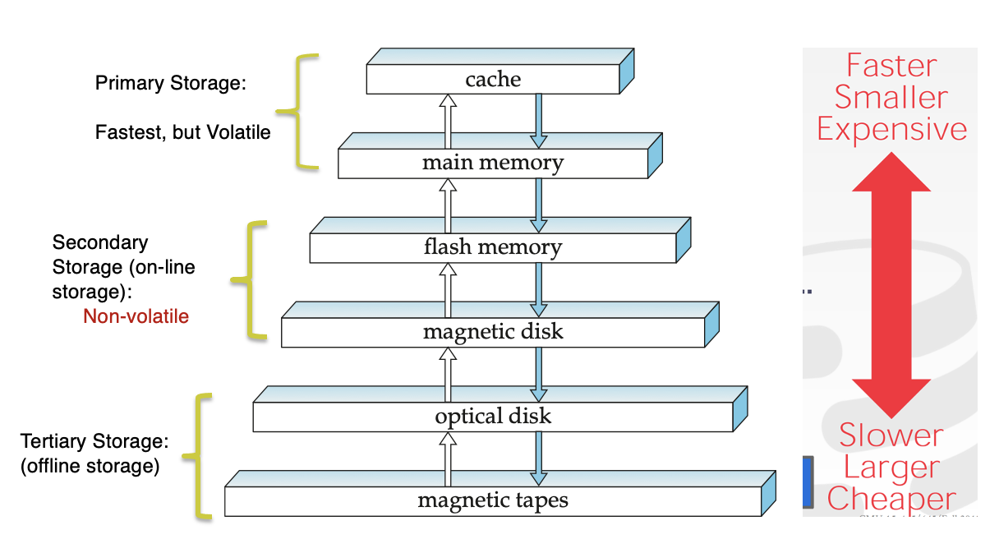

# Storage

## Overview of Physical Storage Media 
a. Storage mediums are classified by:
      - speed at which data is accessed 
      - cost per unit of data 
      - reliability 
      
$$\\[.1cm]$$
b. Available Mediums:
      - cache 
      - main memory 
      - flash memory 
      - magnetic disk storage 
      - optical storage 
      - tape storage 
      
$$\\[.1cm]$$

c. Cache - fastest & most costly; relatively small & managed by computer systems hardware

d. Main Memory - storage medium for data that is readily availabe to be operated on
      - generally too small (too expensive) for entire large databases
      - can be lost when system crashes or in event of power failure 
      
$$\\[.1cm]$$

e. Flash memory - lower cost per byte than main memory but higher cost per byte than magnetic disks; 
      - widely used in cameras, cellphones, & USB flash drives
      - non-volatile medium 
      - popular substitute for magnetic disks in PCs
      - `SOLIF STATE DRIVE (SSD)` uses flash memory but its interface is also block-oriented like magnetic disk 
      - block-oriented interface - allows data to be stored & retrieve in units of a block
      
$$\\[.1cm]$$

f. Magnetic disk storage - primary medium for long term online storage of data
      - aka hard disk drive (HDD)
      - non-volatile but disks may fail & destroy data though rarely happens 
      - to access data, systems moves data from disk to main memory & modified data must be written back to disk 

$$\\[.1cm]$$

g. optial storage - disks like DVDs where data is written & read back using a laser light source 

h. tape storage - used primary for back ups & archival data 
      - cheaper than disks & can store data for many years 
      - data must be read from beginning of tape, thus is called a sequential access storage
      
$$\\[.1cm]$$

i. `SEQUENTIAL ACCESS` - read data from beginning 

j. `DIRECT-ACCESS` - read data from any location on medium 

k. `PRIMARY STORAGE` - fastest storage media but also most expensive 
      - cache 
      - main memory 
      
$$\\[.1cm]$$

l. `SECONDARY/ONLINE STORAGE` - flash memory & magnetic disks

m. `OFFLINE/TERTIARY STORAGE` - magnetic tapes & disk jukeboxes 

{}

[Storage Hierarchy]()

$$\\[.1cm]$$
