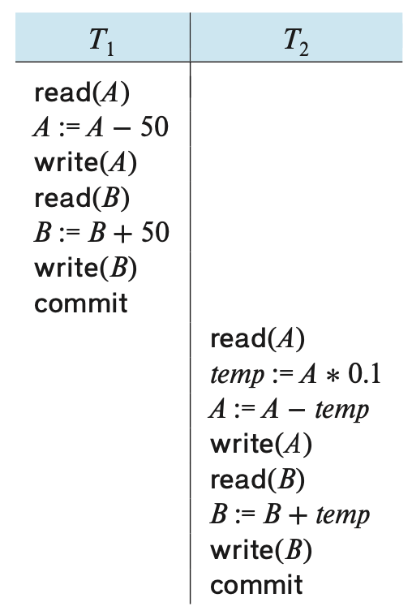
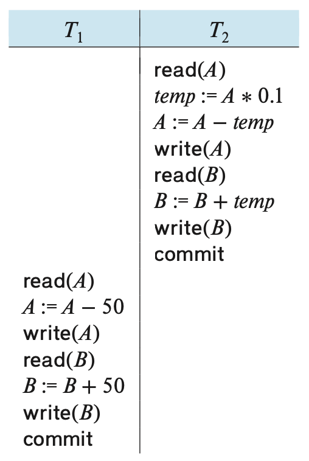
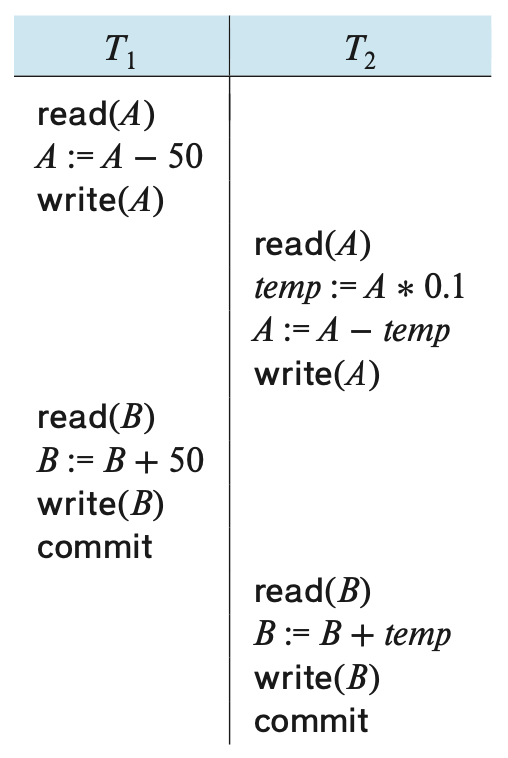
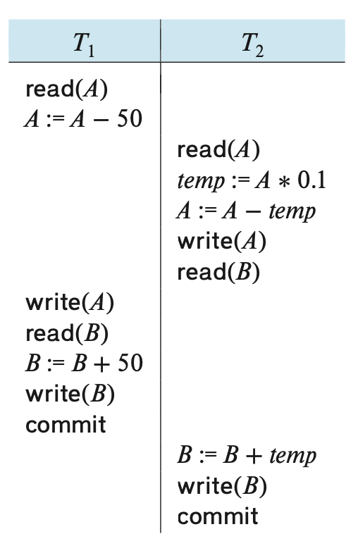
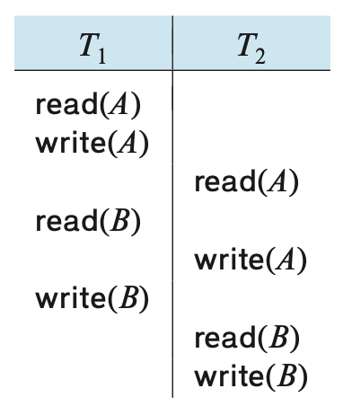
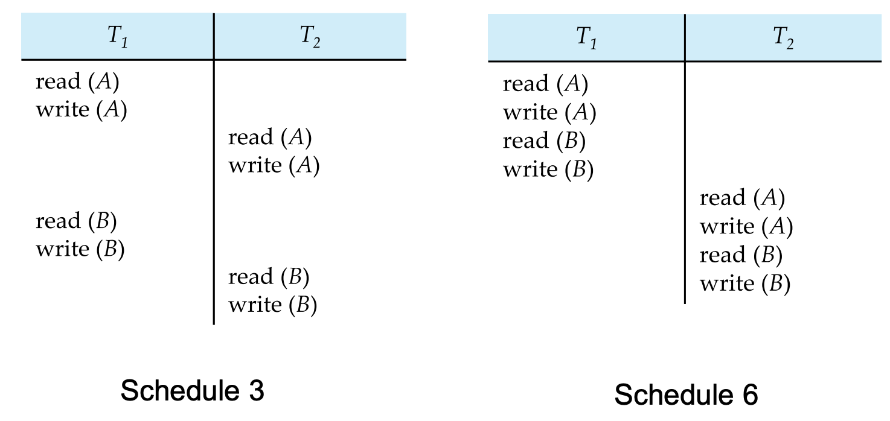
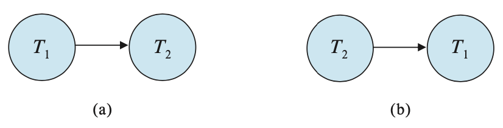
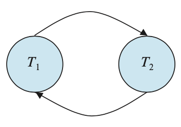
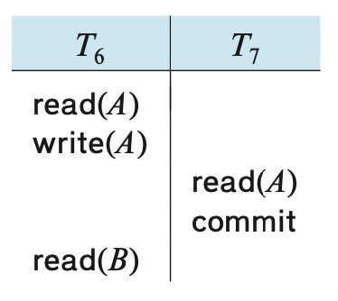
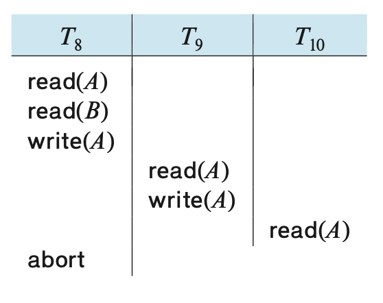

# Transactions 

## Transaction Concept 
a. `TRANSACTION` - a unit of program execution that accesses and possibly updates various data items. 
      - usually initiated by a data-manipulation language, or programming language w/embedded database accesses
      - transactions are grouped btw function calls, _begin transaction_ and _end transaction_ 
      - one transaction is every step btw the begin and end calls 
      - a transaction must execute in it entirety or not at all 

$$\\[.1cm]$$

b. `ATOMICITY` - this 'all-or-none' property of transaction

c. `ISOLATION` - ensuring that transactions operate properly w/o interference from concurrently executing database statements

d. `DURABILITY` - ensuring that the transaction's actions remain even after system crashes 

e. `CONSISTENCY` - execution of a transaction in isolation preserves the consistency of the database

## A Simple Transaction Model
a. consistency is the responsibility of the application programmer who codes the transaction 

b. atomicity and durability is handled by a component of the database called the recovery system 

c. isolation is maintained by the concurrency-control system component of a databse. 
      - isolation makes sure that concurrenct executions results in  the same resulting state as the end state where all transactions were ran in a serial order, one after another

## Storages
a. types of storage:
      - volatile storage - main memory and cache memory do not usually survive system crashes but has fast access to data 
      - non-volatiel storage - secondary and tertiary storage survives system crashes but has slower access to data 
      - stable storage - storage that replicates info. in several non-volatile disks with independent failure modes; info in stable storage is theoretically _never_ lost 

$$\\[.1cm]$$     

b. for a transaction to be durable, changes need to be written to stable storage 

c. for a transaction to be atomic, log records need to be written to stable storage before any changes are made to database 

## Atomicity and Durability 
a. `ABORTED` - to halt execution of a transcation 

b. `ROLLED BACK` - when changes caused by an aborted transaction have been undone 
      - this is typically done by recovery system and a log 
      - first, record the identifier of the transaction performing the change; the identifier of the data item being modified; the old values; and then the new values
      - after everything is recorded, the database is modified
      
$$\\[.1cm]$$     

c.`COMMITTED` - a successfully execution of a transaction 

d.`COMPENSATING TRANSACTION` - the only way to undo the effects of a committed transaction 
      - not always possible to create such a compensating transaction so usually the user writes and executes a compensating transaction 
      
$$\\[.1cm]$$     

e. a _successful_ execution is one where the transaction enters the committed state and not the other 4 states

{width=65%}

[State diagram of a transaction]()

$$\\[.1cm]$$
$$\\[.1cm]$$

{}

[States of a transaction]()

## Isolation 
a. allowing multiple transactions to update data at once can cause consistency problems 

b. but concurrency has two big benefits:
      - Improved throughput and resource utilization - the num. of transactions executed in a given time is higher and the processor and disk spends less time idle 
      - Recudes waiting time - some transactions operate on different parts of the databases and are short, so its better to let them share CPU cycles and disk accesses   
$$\\[.1cm]$$

c. `CONCURRENCY-CONTROL SCHEMES` - variety of mechanism employed by the database system to control the interaction among concurrent transactions and to prevent them from destroying the consistency of the database
      - individually, each transaction may be correct but when ran concurrently, they still can violated the isolation property and cause inconsistency 
      
$$\\[.1cm]$$

d. Schedules - execution sequences that helps identify isolation-abiding transactions and database consistency 

e. Serial v. Concurrent Schedules:
      - serial schedules are one where the instructions belonging to one single transaction appear together in that schedule
      - concurrent schedules are ones where instructions are executed concurrently 
      - Ex. 

{width=25%}

[Schedule 1 - a serial schedule where T1 is followed by T2]()

$$\\[.1cm]$$

{width=25%}

[Schedule 2 - a serial schedule where T2 is followed by T1]()

$$\\[.1cm]$$

{width=25%}

[Schedule 3 - a concurrent schedule equivalent to schedule 1]()

$$\\[.1cm]$$

{width=25%}

[Schedule 4 - a concurrent schedule resulting in an inconsistent state that does not preserve the value of A+B]()

$$\\[.1cm]$$

f. `SERIALIZABLE` - if a concurrent schedule can be equivalent to s serial schedule 

## Serializability 
a. Different forms of schedule equivalence give rise to
the notions of:
      - conflict serializability
      - view serializability 
      
$$\\[.1cm]$$

b. conflict - two instruction commands are in conflict iff their transactions are different and at least one of the commands is a write(...) instruction

            Ex. 
            1) i = read(Q), j = read(Q). l and j don’t conflict.
            2) i = read(Q), j = write(Q). They conflict.
            3. i = write(Q), j = read(Q). They conflict
            4. i = write(Q), j = write(Q). They conflict

c. If __i__ and __j__ are consecutive instructions are from different transactions and do _not conflict_, we can swap the order of __i__ and __j__ to produce a new schedule 

            Ex. 
            • Swap the read(B) instruction of T1 with the read(A) instruction of T2. 
            • Swap the write(B) instruction of T1 with the write(A) instruction of T2. 
            • Swap the write(B) instruction of T1 with the read(A) instruction of T2.
            

{width=25%}

[Schedule 5 - same as schedule 3 after swapping nonconflicting instructions]()

$$\\[.1cm]$$

d. `CONFLICT EQUIVALENT` - when a schedule can be transformed into another schedule by a series of swaps on nonflicting instructions 

e. a schedule S is conflict serializable if it is conflict
equivalent to a serial schedule

f. Schedule 3 can be transformed into Schedule 6, a serial schedule
where T2 follows T1, by series of swaps of non-conflicting instructions. Therefore Schedule 3 is conflict serializable.

{width=75%}

[Schedule 6 - a serial schedule that is equivalent to schedule 3]()

$$\\[.1cm]$$
g. `PRECEDENCE GRAPH` -  a direct graph used for testing serializability where the vertices are the transactions
      - Ex. 

{width=75%}

[(a) is the precedence graph of schedule 1 and (b) is the precedence graph of schedule 2. (a) only has a single edge from T1 -> T2 because all instructions of T1 are executed before the first instruction of T2. Same logic for (b).]()

$$\\[.1cm]$$
h. If a graph contains a cycle, then the schedule is not conflict serializable.
      - EX.

{width=50%}

[This recedence graph for schedule 4 has T1 -> T2 b/c T1 executes read(A) before T2 executes write(A). It also contains the edge T2 -> T1 b/c T2 executes read(B) before T1 executes write(B).]()

$$\\[.1cm]$$
i. However, some non-serializable schedules can still maintain consistency 
      - Ex. 

{width=75%}

[Schedule 7 - a nonserial schedule that maintains consistency and returns the same values as the serial schedule, <T1, T5>]()

## Isolation and Atomicity
a. If T1 fails, we need to undo the effects of T1 to ensure atomicity 

b. IF T2 is dependent on T1 (i.e. T2 reads data written by T2), then T2 must also be aborted 

c.`RECOVERABLE SCHEDULE` - a schedule where for each pair of transactions T1 and T2, where T2 reads data previously written by T1, the commit for T1 must appear before the commit for T2
      - EX. 
      

{width=25%}

[a partial (has no commit or abort operation after T6) and nonrecoverable (T7 commits before T6) schedule]()

$$\\[.1cm]$$
d.`CASCADING ROLLBACK` – a single transaction failure leads to a series of
transaction rollbacks. Consider the following schedule where none of
the transactions has yet committed (so the schedule is recoverable)
      - EX. 

{width=50%}

[If T8 fails, T9 and T10 must also be rolled back.Can lead to the undoing of a significant amount of work]()

$$\\[.1cm]$$

e. `CASCADELESS SCHEDULES` — schedules where cascading rollbacks cannot occur
      - For each pair of transactions T1 and T2 such that T2 reads a data item
previously written by T1, the commit of T1 must appear before the read operation of T2
      - every cascadeless schedule is also recoverable
      - best to restrict the schedules to those that are cascadeless

## Transaction Isolation Levels 
a. database systems offer isolation levels weaker than serializability to allow less re- striction of concurrency and thus improved performance 
      - this introduces a risk of inconsistency that some applications find acceptable

$$\\[.1cm]$$
b. SQL allows a transaction to specify the level it may executed in

c. the isolation levels in SQL are
      - serializable is the default & only allows serializable execution
      - repeatable read allows only commited data to be read and requires that repeated reads of the same record must return the same value
      - read committed allows only commited data to be read & successive reads of record may return different (but committed) values 
      - read uncommitted allows uncommitted data to be read; lowest isolation level allowed by SQL 

