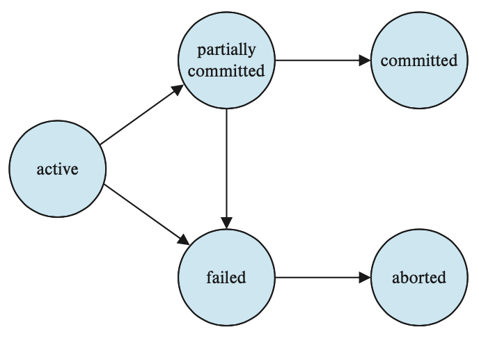
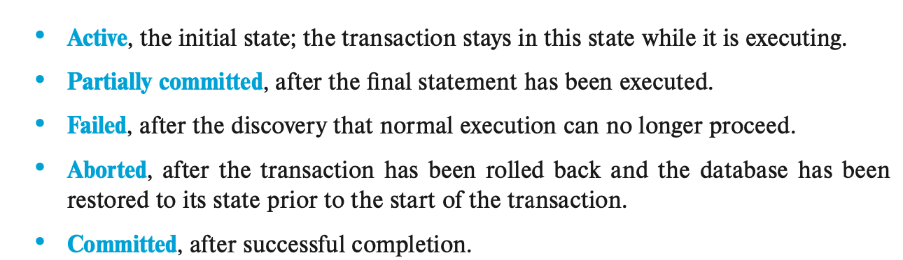

# Transactions 

## Transaction Concept 
a. `TRANSACTION` - a unit of program execution that accesses and possibly updates various data items. 
      - usually initiated by a data-manipulation language, or programming language w/embedded database accesses
      - transactions are grouped btw function calls, _begin transaction_ and _end transaction_ 
      - one transaction is every step btw the begin and end calls 
      - a transaction must execute in it entirety or not at all 

$$\\[.1cm]$$

b. `ATOMICITY` - this 'all-or-none' property of transaction

c. `ISOLATION` - ensuring that transactions operate properly w/o interference from concurrently executing database statements

d. `DURABILITY` - ensuring that the transaction's actions remain even after system crashes 

e. `CONSISTENCY` - execution of a transaction in isolation preserves the consistency of the database

## A Simple Transaction Model
a. consistency is the responsibility of the application programmer who codes the transaction 

b. atomicity and durability is handled by a component of the database called the recovery system 

c. isolation is maintained by the concurrency-control system component of a databse. 
      - isolation makes sure that concurrenct executions results in  the same resulting state as the end state where all transactions were ran in a serial order, one after another

$$\\[.1cm]$$     

d. types of storage:
      - volatile storage - main memory and cache memory do not usually survive system crashes but has fast access to data 
      - non-volatiel storage - secondary and tertiary storage survives system crashes but has slower access to data 
      - stable storage - storage that replicates info. in several non-volatile disks with independent failure modes; info in stable storage is theoretically _never_ lost 

$$\\[.1cm]$$     

e. for a transaction to be durable, changes need to be written to stable storage 

f. for a transaction to be atomic, log records need to be written to stable storage before any changes are made to database 

## Atomicity and Durability 
a. `ABORTED` - to halt execution of a transcation 

b. `ROLLED BACK` - when changes caused by an aborted transaction have been undone 
      - this is typically done by recovery system and a log 
      - first, record the identifier of the transaction performing the change; the identifier of the data item being modified; the old values; and then the new values
      - after everything is recorded, the database is modified
      
$$\\[.1cm]$$     

c.`COMMITTED` - a successfully execution of a transaction 

d.`COMPENSATING TRANSACTION` - the only way to undo the effects of a committed transaction 
      - not always possible to create such a compensating transaction so usually the user writes and executes a compensating transaction 
      
$$\\[.1cm]$$     

e. a _successful_ execution is one where the transaction enters the committed state and not the other 4 states

{}

[State diagram of a transaction]()

$$\\[.1cm]$$
$$\\[.1cm]$$

{}

[State diagram of a transaction]()

## Isolation 
a. allowing multiple transactions to update data at once can cause consistency problems 

b. but concurrency has two big benefits:
      - Improved throughput and resource utilization - the num. of transactions executed in a given time is higher and the processor and disk spends less time idle 
      - Recudes waiting time - some transactions operate on different parts of the databases and are short, so its better to let them share CPU cycles and disk accesses   
$$\\[.1cm]$$

c. `CONCURRENCY-CONTROL SCHEMES` - variety of mechanism employed by the database system to control the interaction among concurrent transactions and to prevent them from destroying the consistency of the database
      - individually, each transaction may be correct but when ran concurrently, they still can violated the isolation property and cause inconsistency 
      
$$\\[.1cm]$$

d. Schedules - execution sequences that helps identify isolation-abiding transactions and database consistency 

